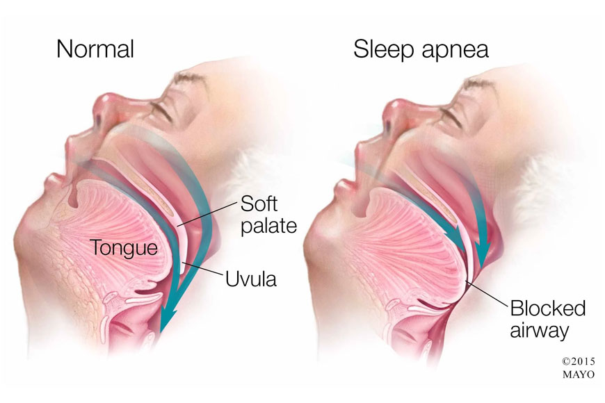

# Face Detection 



## What is OSA?
Obstructive sleep apnea (OSA) is characterized by episodes of complete collapse of the airway or partial collapse with an associated decrease in oxygen saturation or arousal from sleep. This disturbance results in fragmented, nonrestorative sleep.

## Detection Of OSA using Machine Learning Model
- Using CNN models, we are Training 500 dataset

---

# Let's jump into the code
### What are the requirements you need to have before running the code (all latest version)
```python
--- python
--- tensorflow
```


